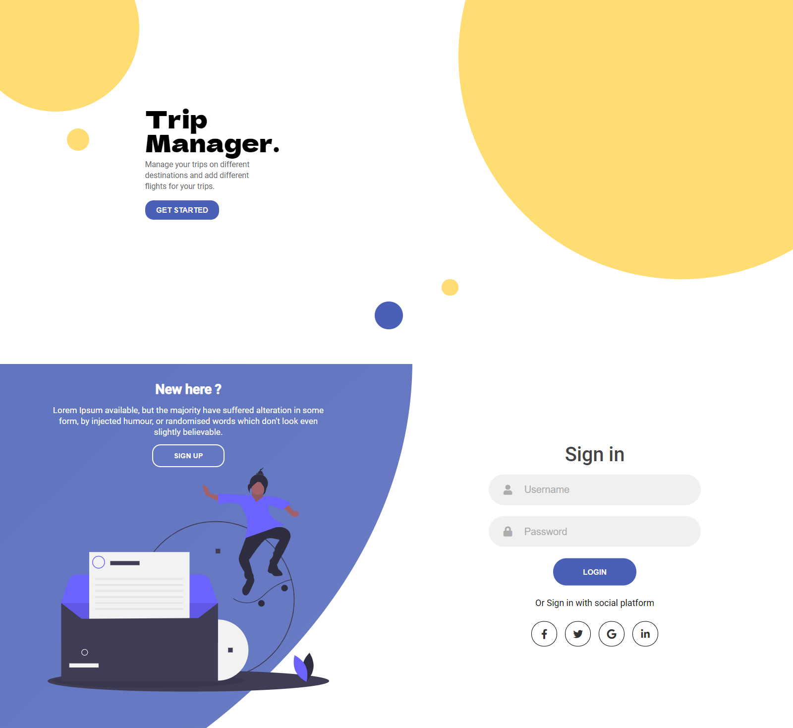
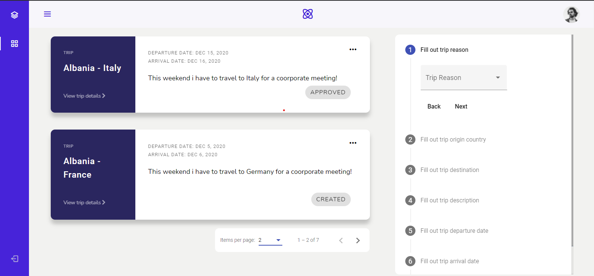
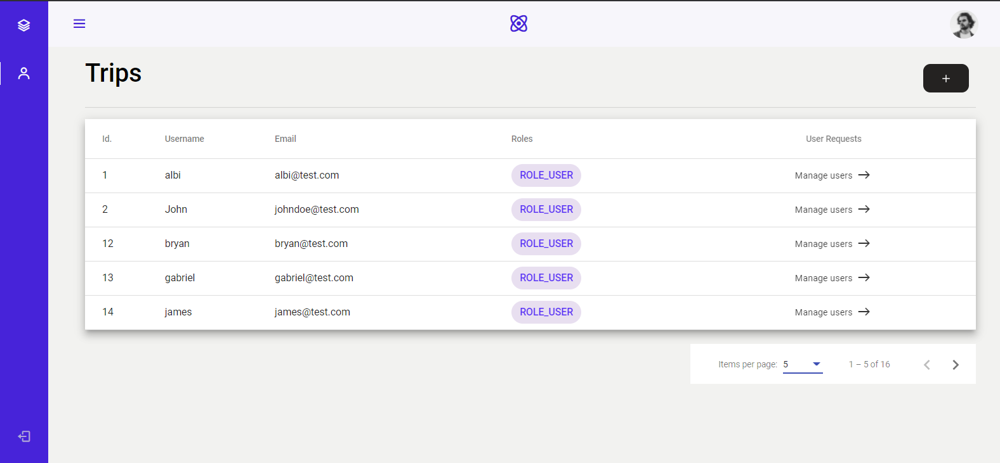
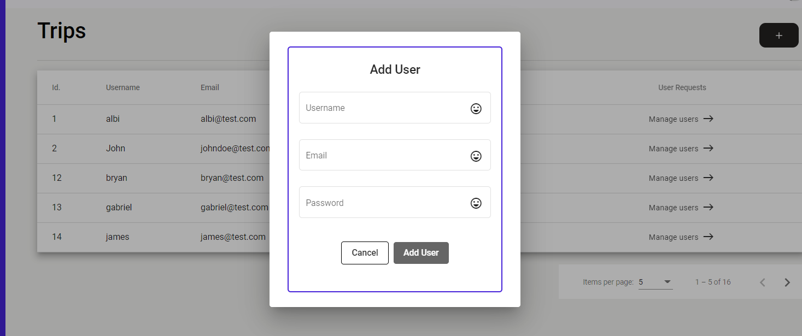
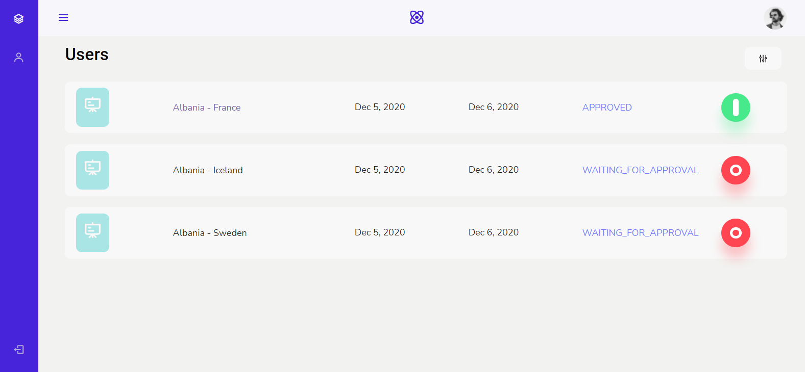
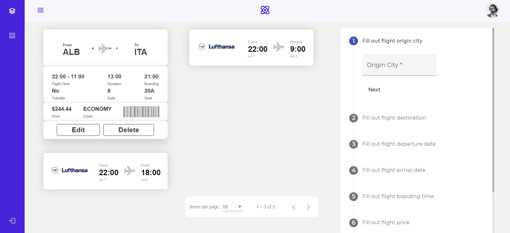

# Trip Web App

A trip web application built to help you track your trips.

## How To Run

- Clone the repository
- Install dependencies
- Run the project

```
git clone https://github.com/albi2/TripsApplication.git
npm install
ng s -o
```


## What's included

- Angular
- Angular Material
- rxjs
- Backend connection

### Folder Structure

```
.
├── app
│   ├── app-routing.module.ts
│   ├── app.component.html
│   ├── app.component.scss
│   ├── app.component.spec.ts
│   ├── app.component.ts
│   ├── app.module.ts
│   ├── components
│   │   ├── add-edit-trip
│   │   ├── admin-user-details
│   │   ├── my-trips
│   │   ├── panels
│   │   ├── sidebar
│   │   ├── sign-in-up
│   │   ├── signup-dialog
│   │   └── users
│   ├── guards
│   │   ├── AdminGuard.ts
│   │   └── GeneralUserGuard.ts
│   ├── interceptors
│   │   └── web-request.interceptor.ts
│   ├── models
│   │   ├── JwtResponse.ts
│   │   ├── LoginRequest.ts
│   │   ├── PagedResponse.ts
│   │   ├── RefreshTokenResponse.ts
│   │   ├── Trip.ts
│   │   ├── User.ts
│   │   └── UserCreationDTO.ts
│   ├── pages
│   │   ├── homepage
│   │   └── my-profile
│   ├── services
│   │   ├── admin.service.spec.ts
│   │   ├── admin.service.ts
│   │   ├── auth.service.spec.ts
│   │   ├── auth.service.ts
│   │   ├── token.service.spec.ts
│   │   ├── token.service.ts
│   │   ├── trip.service.spec.ts
│   │   └── trip.service.ts
│   └── shared
│       ├── searchbar
│       ├── toggle
│       └── trip-card
├── assets
│   ├── img
│   │   └── perfil.jpg
│   ├── js
│   │   └── sidebar.js
│   ├── scss
│   │   └── _base.scss
│   └── svg
│       ├── sign_in.png
│       ├── sign_in.svg
│       └── sign_up.svg
├── environments
│   ├── environment.prod.ts
│   └── environment.ts
├── favicon.ico
├── index.html
├── main.ts
├── polyfills.ts
├── styles.scss
└── test.ts
```
## Demo







